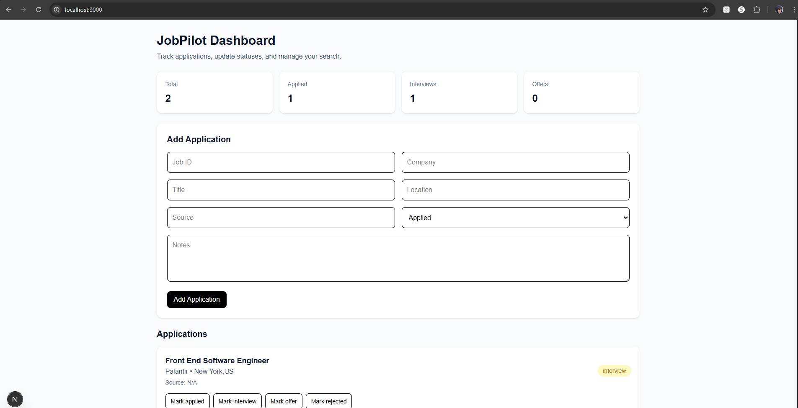
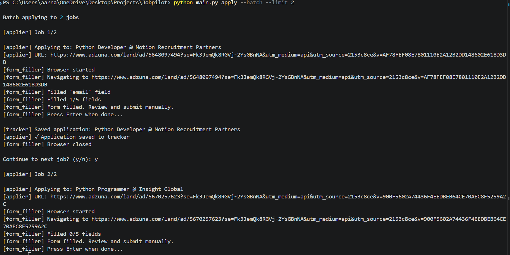

# 🚀 JobPilot — Full-Stack Job Application Tracker (In the Big 2026)

JobPilot is a full-stack system designed to help you **track, manage, and analyze your job applications** efficiently.

It combines:
-  FastAPI backend
-  SQLite database
-  Next.js + TypeScript frontend

---

## Features

### Dashboard
- View all applications in a clean UI
- See company, role, and status
- Sorted by most recent updates

###  Add Applications
- Add jobs directly from the frontend
- Store metadata like:
  - company
  - title
  - location
  - source
  - notes
  - resume used

### Status Tracking
- Update status instantly:
  - Applied
  - Interview
  - Offer
  - Rejected

### Summary Metrics
- Total applications
- Interviews
- Offers
- Rejections

### API-Based Architecture
- Decoupled frontend and backend
- FastAPI REST API
- Swagger docs available

---

##  Project Structure

```
JobPilot/
├── backend/
│   └── app/
│       ├── main.py
│       ├── db.py
│       ├── models.py
│       ├── schemas.py
│       └── crud.py
│
├── frontend/
│   ├── app/
│   ├── components/
│   ├── lib/
│   └── types/
│
├── scraper/
├── applier/
├── tracker/
├── data/
├── requirements.txt
└── README.md
```

---

##  Tech Stack

### Backend
- FastAPI
- SQLAlchemy
- SQLite
- Pydantic

### Frontend
- Next.js
- TypeScript
- Tailwind CSS

---

##  Getting Started

### 1. Clone Repository

```bash
git clone https://github.com/YOUR_USERNAME/jobpilot.git
cd jobpilot
```

---

### 2. Backend Setup

```bash
python -m venv .venv
.venv\Scripts\activate   # Windows

pip install -r requirements.txt
```

Run backend:

```bash
uvicorn backend.app.main:app --reload
```

Backend:
```
http://127.0.0.1:8000
```

Docs:
```
http://127.0.0.1:8000/docs
```

---

### 3. Frontend Setup

```bash
cd frontend
npm install
npm run dev
```

Frontend:
```
http://localhost:3000
```

---

## 🔗 Architecture

```
Frontend (Next.js)
        ↓
FastAPI Backend
        ↓
SQLite Database
```

---

#  Data Models

## Job
- id
- title
- company
- location
- url
- source
- description
- salary
- easy_apply

## Application
- job_id
- status
- date_applied
- date_updated
- notes
- resume_used
- interview_date
- offer_amount

---

#  Important Notes

## LinkedIn Scraping
LinkedIn scraping is currently a placeholder. Production usage would require:
- official APIs
- authenticated browser automation
- or third-party services

---

## Auto-Apply Safety
Auto-submit is disabled by default.  
Always review applications before submitting.

---

## Rate Limiting
To avoid blocking:
- use delays between requests
- avoid aggressive scraping
- respect site policies

---

#  Example API Request

```json
POST /applications

{
  "job_id": "test_1",
  "company": "Google",
  "title": "Software Engineer",
  "location": "Remote",
  "source": "indeed",
  "status": "applied"
}
```

---

#  Demo 

##  Screenshots

### Dashboard


### Add Application Form


---

#  Roadmap

- Support for additional job boards
- Chrome extension for saving jobs
- Web dashboard improvements
- Resume & cover letter templating
- Application analytics enhancements

---

#  Security

The following are NOT committed:
- config.yaml
- .env files
- database files (*.db)
- personal data inside `/data`

Use:
```
config.example.yaml
```
as a template.

---

#  License

MIT License

---

#  Built by

**Arnaud Viegas**